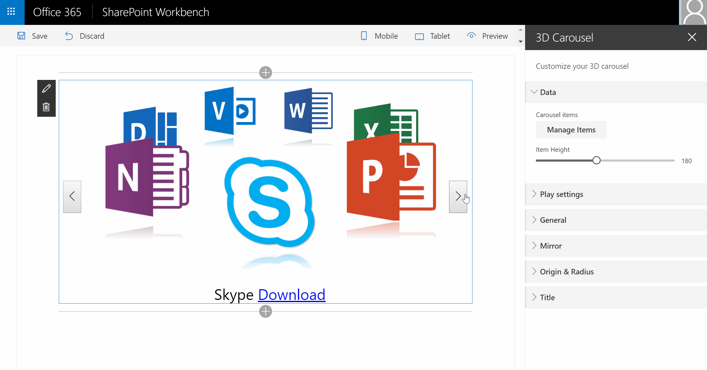
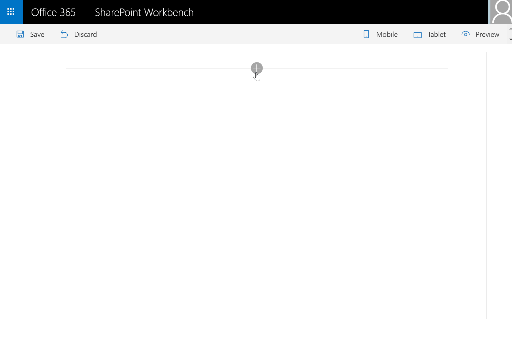

## spfx-40-fantastics

This is where you include your web part docs.

### Building the code

```bash
git clone the repo
npm i
npm i -g gulp
gulp
```

## 3D Carousel Web Part

The 3D Carousel Web Part is a SharePoint client side web part built with the SharePoint Framework (SPFx) in the preview version.
This web part adds a 3D carousel animation with picture, title and link.
This project uses the JQuery plugin [jquery.cloud9carousel.js](http://specious.github.io/cloud9carousel/) created by R. Cecco.
This web part uses also the [Custom Fields library](https://github.com/OlivierCC/sp-client-custom-fields) to enhance the web part edition experience.

Thanks to this WP, you can insert your text, change the radius, the direction, the size, the font, etc.
Your title has now an awesome look.



## Features

You can configure the following Web Part settings:
* **Manage items**: Collection of carousel items. An item is composed of a Title (mnandatory), a Picture Url (mandatory), a boolean to indicate if the
item is enabled or disabled, a link url (optional) and a link text (optional).
* **Item Height**: Carousel item height in pixels (default 180)
* **Speed**: Relative speed factor of the carousel. Any positive number: 1 is slow, 4 is medium, 10 is fast. Adjust to your liking
* **Autoplay**: Automatically rotate the carousel by this many items periodically. Auto-play is not performed while the mouse hovers over the carousel container (default is true).
* **Autoplay delay**: Delay, in milliseconds, between auto-play spins (default is 4000)
* **Height**: Carousel container's height in pixels (default is 400)
* **Show Title**: Indicates if the title is displayed or not (default is true)
* **Show Buttons**:Indicates if the buttons are displayed or not (default is true)
* **Bring to Front**: Indicates if clicking an item will rotate it to the front (default is true)
* **Mirror Gap**: Vertical gap in pixels between the bottom of the item (at full size) and the top of its reflection (default is 2)
* **Mirror Height**: The height of the reflection relative to the height of the item (range: 0 to 1) (default is 0.2)
* **Mirror Opacity**: Opacity of the reflection at its top (most visible part) (range: 0 to 1) (default is 0.4)
* **Y Origin**: Center of the carousel (y coordinate)
* **Y Radisu**: Half the height of the carousel
* **X Origin**: Center of the carousel (x coordinate)
* **X Radisu**: Half the width of the carousel
* **Title Font**: specifies the Title font family as Arial, Verdana, etc.
* **Title Size**: sets the Title font size
* **Title Color**: sets the Title font color

## Photopile Web Part

The photopile-web-part project is a SharePoint web part built using the SharePoint Framework (SPFx) in the preview version.
This project implements the great [Photopile.Js](https://github.com/bigbhowell/Photopile-JS) created by Brian W. Howell
(a popular jquery script) as a client side web part for SharePoint.

With this Web Part, you can display the photos contained in a SharePoint Pictures Library as a cool image gallery that
simulates a pile of photos scattered about on a surface. Thumbnail clicks remove photos from the pile,
(enlarging them as if being picked up by the user), and once in  view a secondary click returns the photo to the pile.


> Note: The SharePoint Framework is currently in preview and is subject to change. SharePoint Framework client-side web parts are not currently supported for use in production enviornments.

## Features

This web part uses React, Office UI Fabric, JQuery, JQuery UI and Photopile.js. This web part is available in English (en-us)
and French (fr-fr). You can use this web part with SharePoint Online (Office 365) or SharePoint Server 2016.

It is able to:
* List Picture Libs contained in the current SharePoint web site
* List all the pictures in the selected List
* Render the pics as a cool photopile
* Personalize the layout thanks to editable settings

If you are a SharePoint web developer, you can be interested by the following code patterns :
* Include JQuery and external framework in your solution
* Implement rich web part properties panel with controls like DropDown, Sliders, Toggle, etc.
* Load dynamic data from SharePoint as web part properties
* Load dynamic data from SharePoint REST Services, as lists or items
* Implement mock system to test your solution in the local workbench or on a SharePoint site
* Include Office UI Fabric controls in your project
* Render content with React
* Etc.


## ArcText Web Part

The ArcText Web Part is a SharePoint client side web part built with the SharePoint Framework (SPFx) in the preview version.
This web part adds a curved text effect to your titles.
This project uses the JQuery plugin [jquery.arctext.js](https://github.com/codrops/Arctext) created by Pedro Botelho.
This web part uses also the [Custom Fields library](https://github.com/OlivierCC/sp-client-custom-fields) to enhance the web part edition experience.

Thanks to this WP, you can insert your text, change the radius, the direction, the size, the font, etc.
Your title has now an awesome look.



## Features

You can manage the following settings:
* **Text**: sets your text
* **Radius**: specifies the radius
* **Rotate Letters**: indicates if the letters must rotate or stay vertical
* **Reverse**: reverses the curved effect
* **Align**: aligns text on left, center or right
* **Font**: specifies the font family as Arial, Verdana, etc.
* **Size**: sets the font size
* **Color**: sets the font color
